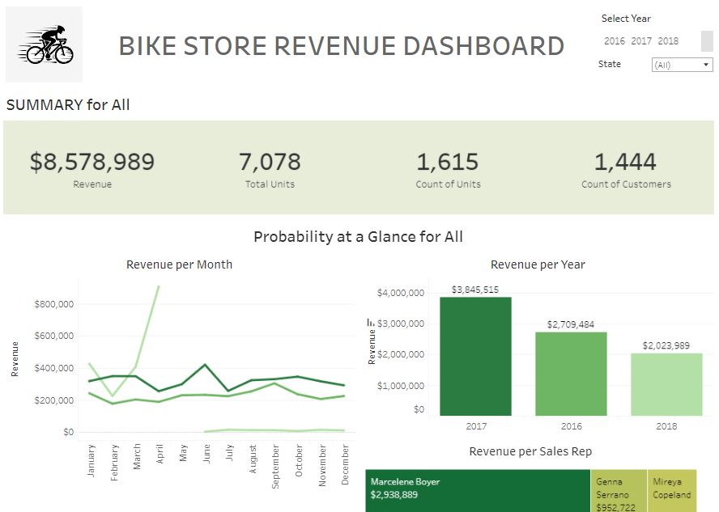

# Bike Store's Sales Report

## Table of Content 
- [Project Overview](#project-overview)
- [Data Sources](#data-sources)
- [Result](#result)
- [Recomendation](#recomendation)


## Project Overview
This project aims to provide insight into revenue at Bike Stores in 2016 to 2018 in several states such as California, New York, and Texas. 
By analyzing sales data per country, product, and brand, we will get information that can be used to make data-based recommendations so that we can get more income in the following year.



## Data Sources
The data source used in this project is "BikeStores.xlsx" which contains detailed information regarding order data and SQL files that can be executed on SQL Server to create a product table that will be added to the Bike Store revenue database.
- [Download File Source Here](https://github.com/HilmaSabela/Bike_Store_Analysis/blob/main/BikeStores.xlsx)

## Tool
SQL 
- Cleaning and Transforming Data 
Excel 
- Analyzing Data 
Tableau - 
- Visualizing Data 

### The steps of analyzing data
In this phase, after storing the data in SQL Server database, I perform the following tasks:
- ETL (Extract, Transform, Load)
Combine the required data from several tables then save the results in Excel

Include some interesting code/features worked with
``` sql
SELECT 
	ord.order_id, 
	CONCAT(cus.first_name, ' ' , cus.last_name) AS 'customer_name', 
	cus.city, 
	cus.state, 
	ord.order_date,
	SUM(ite.quantity) AS 'total_units',
	SUM(ite.quantity * ite.list_price) AS 'revenue',
	prod.product_name,
	bran.brand_name,
	cat.category_name,
	sto.store_name,
	CONCAT(sta.first_name, ' ' , sta.last_name) AS 'sales_rep'
FROM sales.orders AS ord
JOIN sales.customers AS cus
	ON  ord.customer_id = cus.customer_id 
JOIN sales.order_items AS ite
	ON ord.order_id = ite.order_id
JOIN production.products AS prod
	ON ite.product_id = prod.product_id
JOIN production.brands AS bran
	ON bran.brand_id = prod.brand_id
JOIN production.categories AS cat
	ON cat.category_id = prod.category_id
JOIN sales.stores AS sto
	ON sto.store_id = ord.store_id
JOIN sales.staffs AS sta
	ON sta.staff_id = ord.staff_id
GROUP BY 
	ord.order_id, 
	CONCAT (cus.first_name, ' ' , cus.last_name),  
	cus.city, 
	cus.state, 
	ord.order_date,
	prod.product_name,
	bran.brand_name,
	cat.category_name,
	sto.store_name,
	CONCAT(sta.first_name, ' ' , sta.last_name)
```

- EDA (Exploratory Data Analysis)
Using a pivot table to analyze and summarize the cleaned data, then using a pivot chart to analyze data using various types of graphs to answer key questions:

1. When was the highest income from 2016-2018?
2. Which countries and stores had the highest revenue during 2016-2018?
3. Which brands and products have the highest revenue?

### Result
Summary of the results of data analysis as follows:
1. The highest revenue of the 3 stores was in 2017 with total revenue of 3.5 million dollars
2. The shop with the highest revenue is Santa Cruz Bikes in California
3. The highest revenue from shops during 2016-2018 was Mountain Bikes under the Trek brand.

### Recommendation
What I might recommend, especially for the Rowlett Bikes store in Texas that generated the lowest sales of the three stores, is to increase efforts to attract customers with attractive advertisements and promos on products that customers are interested in each season. Providing discounts on best-selling products is also highly recommended to increase sales and attract customers.

